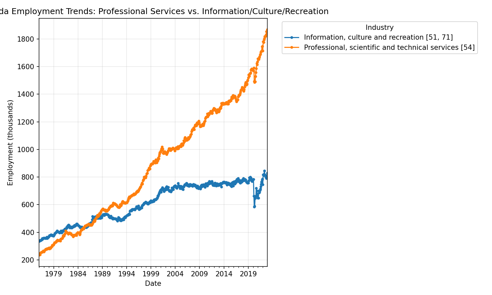

# Canada Employment Trends — Professional Services vs. Information/Culture/Recreation

**Tools used:** Python · pandas · matplotlib  
**Dataset:** [Canada Employment Trend Cycle Dataset - Official](https://www.kaggle.com/datasets/rohithmahadevan/canada-employment-trend-cycle-dataset-official) (Statistics Canada Table 14-10-0355)  
**Status:** Complete

---

## Project Overview

Analyzed Statistics Canada employment data to compare long-term employment 
trends between two industries: Professional, scientific and technical 
services (e.g., IT, engineering, consulting, legal, and research services), and Information, culture and recreation (e.g., telecommunications, media, libraries, arts, and entertainment sectors). This project was 
motivated by my own transition into data and AI-adjacent roles — I wanted 
to see how employment in this sector has actually grown over time using 
real national data.

---

## Questions I Explored

- How has employment in Professional/Scientific/Technical services changed 
  since 1976, compared to Information/Culture/Recreation?
- Which industry has grown faster, in both absolute numbers and percentage terms?
- Did either industry show a visible impact from the COVID-19 pandemic?

---

## Key Findings

- Professional, scientific and technical services employment has grown 
  far more consistently than Information, culture and recreation since 
  the late 1980s — diverging sharply after being roughly comparable in 
  size through the 1970s and 80s
- Over the full 1976–2022 period, Professional/Scientific/Technical 
  services employment grew 694%, compared to 147% growth in 
  Information/Culture/Recreation — nearly 5x the growth rate
- As of late 2022, Professional/Scientific/Technical services employs 
  roughly 1.85 million people in Canada, compared to roughly 830,000 in 
  Information/Culture/Recreation — over double in absolute terms
- Both sectors show a sharp, brief employment drop around 2020, consistent 
  with COVID-19 pandemic disruption; Information/Culture/Recreation was 
  hit harder, likely reflecting closures in recreation and entertainment

---

## Chart

---

## Files in This Repository

| File | Description |
|------|-------------|
| `notebook-Canada-employment-trend-cycle-official.ipynb` | Full analysis notebook — data loading, filtering, pivoting, plotting |
| `canada_employment_comparison.png` | Final comparison chart |

---

## Skills Demonstrated

- pandas: filtering with `.isin()`, `pivot_table()`, datetime parsing, 
  percentage growth calculations
- matplotlib: multi-series time-series visualization with legends and styling
- Working with real-world long-format government data (StatCan table structure)
- Data interpretation and insight communication tied to a personal career narrative

---

## About Me

Junior Data Analyst based in Calgary, AB. Background in IT support, 
data reporting, and library systems. Open to entry-level data and 
AI-adjacent analyst roles.

📧 hjoumaa818@gmail.com
